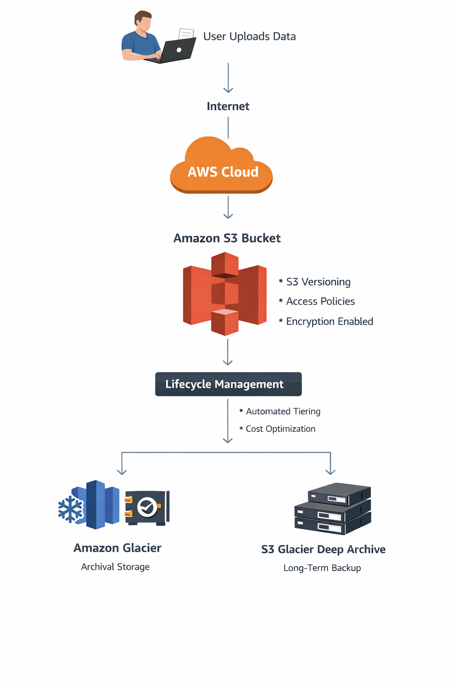

# AWS Cloud Storage Architecture

This project demonstrates the design of a scalable cloud storage architecture using Amazon S3.

## Architecture Diagram

## Architecture Flow

User Upload
    |
Internet
    |
AWS Cloud
    |
Amazon S3 Bucket
    |
Lifecycle Policy
    |
Archive Storage (Glacier)

## AWS Services Used

- Amazon S3
- S3 Lifecycle Policies
- AWS IAM
- CloudWatch Monitoring

